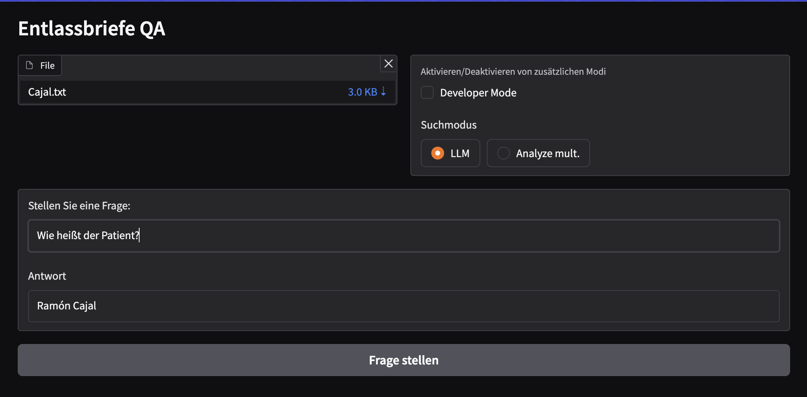

# Generating and evaluating relevant documentation (GERD)

GERD is developed as a library to investigate how large language models (LLMs) can be used to generate and analyze (sets of) documents.

This project was initially forked from [Llama-2-Open-Source-LLM-CPU-Inference
](https://github.com/kennethleungty/Llama-2-Open-Source-LLM-CPU-Inference) by [Kenneth Leung](https://github.com/kennethleungty).
___

## Quickstart

```shell
# 1) Create a virtual environment with a tool of your choice
# e.g. conda, venv or micromamba
micromamba create -n gerd python=3.12
# 2) Activate env; prompt starts with (gerd) now
micromamba activate gerd
# 3) Install poetry
pip install poetry
# 4) Clone project
git clone git@github.com:caretech-owl/gerd.git
cd gerd
# 5) Install dependencies and GERD
# 5.1: You need to chose either CPU or GPU as extras
# to install the correct version of FAISS
# if you unsure, use 'cpu'
poetry install --extras cpu
# 5.2: Alternatively
# poetry install --extras gpu
# 5.3: To install development dependencies as well
# include 'dev' group
# poetry install --with dev --extras cpu
# 5.4: You can add further extras
# --extras gguf # for llama.cpp and GGUF model support;
# --extras awq  # for GPU model quantization
# --extras gui  # for Gradio GUIs
# 5.5: Recommended for CPU inference
# poetry install --extras cpu --extras gguf --extras gui
# 6) Run GERD 'hello' chat example
# This will download a LLM from https://huggingface.co 
# and may take a while
poe hello
```

## Question and Answer example

Folloq quickstart and make sure to install `gui` and `gguf` dependencies. Next start the qa server.
When the server is done loading, open `http://127.0.0.1:7860` in your browser.

```shell
poe qa
# Some Llama.cpp outut
# ...
# * Running on local URL:  http://127.0.0.1:7860
```

Click the 'Click to Upload' button and search for a [GRASCCO](https://pubmed.ncbi.nlm.nih.gov/36073490/) document named `Caja.txt` which is located in the `tests/data/grascoo` folder and upload it into the vector store. Next, you can query information from the document. For instance `Wie heißt der Patient?` (What is the patient called?).



___
## Used Tools
- **LangChain**: Framework for developing applications powered by language models
- **C Transformers**: Python bindings for the Transformer models implemented in C/C++ using GGML library
- **FAISS**: Open-source library for efficient similarity search and clustering of dense vectors.
- **Sentence-Transformers (all-MiniLM-L6-v2)**: Open-source pre-trained transformer model for embedding text to a 384-dimensional dense vector space for tasks like
- **Poetry**: Tool for dependency management and Python packaging

___
## Files and Content
- `/assets`: Images relevant to the project
- `/config`: Configuration files for LLM applications
- `/examples`: Examples that demonstrate the different usage scenarios
- `/gerd`: Code related to `GERD`
- `/images`: Images for the documentation
- `/models`: Binary file of GGML quantized LLM model (i.e., Llama-2-7B-Chat)
- `/prompts`: Plain text prompt files
- `/templates`: Prompt files as jinja2 templates 
- `/tests`: Unit tests for `GERD`
- `/vectorstore`: FAISS vector store for documents
- `pyproject.toml`: TOML file to specify which versions of the dependencies used (Poetry)
- `requirements.txt`: List of Python dependencies (and version)
___

## References
- https://github.com/kennethleungty/Llama-2-Open-Source-LLM-CPU-Inference
